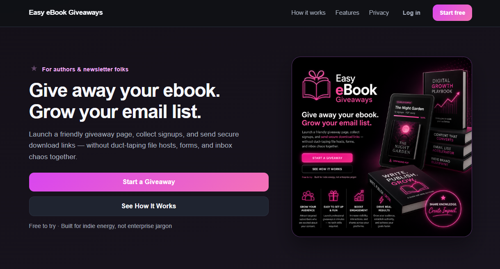
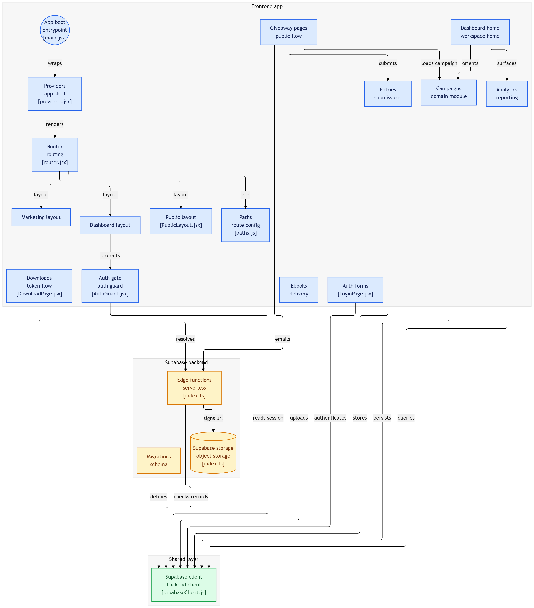

# 📚 Ebook Giveaway App

  

| Logo | Description |
|---|---|
|  | This document captures the major milestones and technical progress made while building the Ebook Giveaway App — a platform for self-published authors to create, host, and deliver free ebook giveaways without relying on third-party email marketing tools. |

## Live site, hosting, and routing

* **Production:** [easyebookgiveaways.com](https://easyebookgiveaways.com/) (GitHub Pages; `public/CNAME`).
* **Alternate URL:** `https://monapdx.github.io/easy-ebook-giveaways/` may redirect to the apex domain; GitHub Pages “project URL only” builds need `VITE_BASE_PATH` set to `/easy-ebook-giveaways/` (see `vite.config.js` and `.github/workflows/deploy.yml`).
* **Client routing:** The app uses **React Router with `HashRouter`**. Deep links must include the hash, for example `https://easyebookgiveaways.com/#/login`, not `/login` (static hosting has no server fallback for non-hash paths).
* **Marketing home** loads at `#/` (pathname `/` inside the hash router). The **author dashboard** lives under `#/app` (not at the site root).
* **Legacy paths:** Old bookmarks like `/#/campaigns/...` are redirected to `#/app/campaigns/...` via `LegacyAppPathRedirect`.

## Screenshots

    

## Diagrams

  

---

## Local development

* **Node:** 20.x (matches CI).
* **Install:** `npm ci` or `npm install`
* **Dev server:** `npm run dev`
* **Env:** set `VITE_SUPABASE_URL` and `VITE_SUPABASE_ANON_KEY` for the Supabase project (Vite exposes `import.meta.env.*`).
* **Production build:** `npm run build` — optional `VITE_BASE_PATH` for subdirectory deploys; the build script copies `dist/index.html` to `dist/404.html` for GitHub Pages.

---

## 🚀 Phase 1: Foundation Setup

### ✅ React App Scaffold

* Created app using React + Vite
* Organized project into modular feature-based architecture
* Implemented routing with React Router (**`HashRouter`** in `src/app/router.jsx`)

### ✅ UI Structure

* Built reusable UI components (including Button, Input, Card, SectionHeader, Textarea, EmptyState)
* Established layout system:

  * **Marketing layout** — public homepage at `#/`
  * **Dashboard layout** — authenticated author app under `#/app`
  * **Public layout** — giveaway and legal pages

---

## 🔐 Phase 2: Authentication (Supabase)

### ✅ Supabase Integration

* Created Supabase project
* Added environment variables (`VITE_SUPABASE_URL`, `VITE_SUPABASE_ANON_KEY`)
* Initialized client (`src/lib/supabaseClient.js`)

### ✅ Auth System

* **Login** (`#/login`), **register** (`#/register` and `#/signup`, same screen)
* Session handling via `useAuth` / Supabase session listeners
* After login, navigation to the prior protected route or `#/app` (`AuthForm`)

### ✅ Route Protection

* Created `AuthGuard`
* Protected dashboard routes under `#/app`
* Redirects unauthenticated users to `/login` (hash route: `#/login`)

---

## 🗄️ Phase 3: Database & Data Model

### ✅ Tables Created

* `profiles`
* `campaigns`
* `landing_pages`
* `ebooks`
* `entries`
* `download_tokens`

### ✅ Relationships Established

* Campaigns belong to users
* Ebooks belong to campaigns
* Entries belong to campaigns
* Download tokens link entries + ebooks

### ✅ Row-Level Security (RLS)

* Enabled RLS on all tables
* Added policies for:

  * Authenticated user ownership (campaigns, ebooks)
  * Public entry submission
  * Token access control

---

## 🧪 Phase 4: Campaign System

### ✅ Campaign Creation

* Form to create campaigns
* Stored in Supabase
* Auto-generated or user-defined slug
* New rows are created with `status: 'published'` by default (`createCampaign`); there is no separate draft toggle in the dashboard yet

### ✅ Campaign Listing

* Fetch campaigns from DB
* Display in dashboard

### ✅ Campaign Overview Page

* View campaign details
* Added section for ebook upload
* **Delete campaign** is implemented in `campaignService` (storage cleanup for ebook files/covers)

---

## 🌐 Phase 5: Public Giveaway Pages

### ✅ Dynamic Routing

* Public route: `#/g/:slug`

### ✅ Real Data Fetching

* Replaced mock data with Supabase queries
* Loaded campaign by slug

### ✅ Entry Form

* Captures:

  * Name
  * Email
  * Newsletter consent
* Stores entries in database

---

## 📦 Phase 6: Ebook Upload System

### ✅ Supabase Storage Integration

* Created `ebook-files` bucket
* Configured storage policies

### ✅ Upload Flow

* Upload file to storage
* Save metadata to `ebooks` table

### ✅ File Validation

* Restricted uploads to:

  * `.pdf`
  * `.epub`
* Handled MIME type (`application/epub+zip`)

### ✅ Dashboard Integration

* Ebook upload form tied to campaign
* Ebook stored per campaign
* Optional ebook cover upload and public URL handling for giveaway/download UI

---

## 🔑 Phase 7: Secure Download System

### ✅ Token-Based Access

* Created `download_tokens` table
* Each entry generates a unique token

### ✅ Token Properties

* Linked to:

  * Campaign
  * Entry
  * Ebook
* Includes:

  * Expiration (24 hours)
  * Download limit (3)
  * Download count tracking

### ✅ Token Generation Flow

* User submits entry
* Token created automatically
* Redirect to `#/download/:token`

---

## ⬇️ Phase 8: Secure File Delivery

### ✅ Token validation (Edge Function)

* `resolve-download` Edge Function validates the download token server-side
* Checks expiration and download limits before issuing a signed storage URL
* Increments download count on the server

### ✅ Signed URL generation (server-side)

* Signed URLs are created inside Edge Functions using the service role (not in the browser)

### ✅ Download link email (Edge Functions)

* After a successful giveaway entry, the app invokes `send-download-email` to issue/reuse a token and send the message
* The project also includes `send-ebook-email` for token-based resend/lock-aware delivery paths
* Delivery is handled server-side via Supabase Edge Functions, with migration-backed tracking fields (`email_sent_at`, `email_send_locked_at`) and lock RPC support (`try_lock_download_email_send`)
* Best-effort **per-IP rate limiting** is implemented in `send-ebook-email` (sliding window)

### ✅ Download page UX

* Readers are still redirected to `#/download/:token` so they can download immediately even if email is delayed

---

## 🔒 Security Considerations (Current State)

### ✅ Implemented

* RLS policies for all core tables
* Token expiration + limits
* Private storage bucket
* Signed URLs issued from Edge Functions (not the React client)
* Download token validation and signed URL creation off the client (`resolve-download`)
* Transactional download email via Edge Functions (`send-download-email` / `send-ebook-email`), with idempotency + lock columns (after migration)

### ⚠️ Future Improvement

* Tighten storage policies further (least privilege beyond signed URLs)
* Optional: move rate limiting to a durable store (Redis / gateway) for multi-region consistency

---

## 🧠 Current System Capabilities

The app now supports:

* Author authentication (login + register)
* Campaign creation and management
* Campaign-level dashboard with overview stats (`#/app`, `#/app/campaigns`, `#/app/campaigns/:campaignId`)
* Campaign design editing + preview (`#/app/campaigns/:campaignId/design`) — **Save** updates in-session preview; persistence to the DB for landing fields is still a roadmap item (see Next Steps)
* Campaign entries management (`#/app/campaigns/:campaignId/entries`)
* Campaign analytics summary cards (`#/app/campaigns/:campaignId/analytics`)
* Public giveaway pages (`#/g/:slug`)
* Success route for giveaway submissions (`#/g/:slug/success`)
* Ebook upload and storage
* Optional ebook cover upload and rendering on giveaway/download pages
* Entry collection
* Token-based gated downloads
* Download tracking and limits
* Download link emails via Edge Functions (DB-backed recipient lookup)
* Privacy route (`#/privacy`) in public layout

---

## 🏁 Major Milestone Achieved

🎉 **Fully functional ebook giveaway pipeline**

Flow:

Author → creates campaign → uploads ebook → publishes
User → visits page → submits form → redirect to download + optional email with the same link

---

## 🔜 Recommended Next Steps

### High Priority

* Run Supabase migrations in timestamp order under `supabase/migrations/`:

  * `20260426140000_download_tokens_email_tracking.sql`
  * `20260426150000_entries_consent_author_contact.sql`
  * `20260503120000_ebook_cover_image.sql`
  * `20260503121000_public_read_published_campaigns_ebooks.sql`
  * `20260504120000_fix_ebook_covers_mime_types.sql`
  * `20260504190000_claim_download_resolution.sql`

* Configure Edge Function secrets: provider API key/sender values, `PUBLIC_SITE_URL`, `SUPABASE_SERVICE_ROLE_KEY`
* Keep email sender/domain settings aligned with your current transactional email provider

### Medium Priority

* 🔁 Replace/overwrite ebook functionality (currently uploads latest file and reads latest attached ebook)
* 🚦 Author-facing **draft / publish** controls (campaigns default to published today; public read policy exists in migrations)
* 📤 CSV export for entries

### UX Improvements

* ✍️ Persist design-form edits directly to DB (design page currently drives preview via in-memory `savedLanding` in `CampaignDesignPage`)
* 🎨 Continue polish for public giveaway and download page variants
* 🧾 Add richer confirmation messaging around email send status on submit

---

## 💡 Final Notes

This project has moved beyond scaffolding into a real, working SaaS foundation.
The core backend complexity—auth, storage, security, and data relationships—is now in place.

Future work is primarily:

* UX polish
* conversion optimization
* deliverability tuning (templates, bounce handling, sender authentication)

---

**Status:** 🟢 MVP Functional (core auth/campaign/entry/download/email flow live)
**Next Focus:** Publishing workflow hardening + export/reporting + UX polish

---
